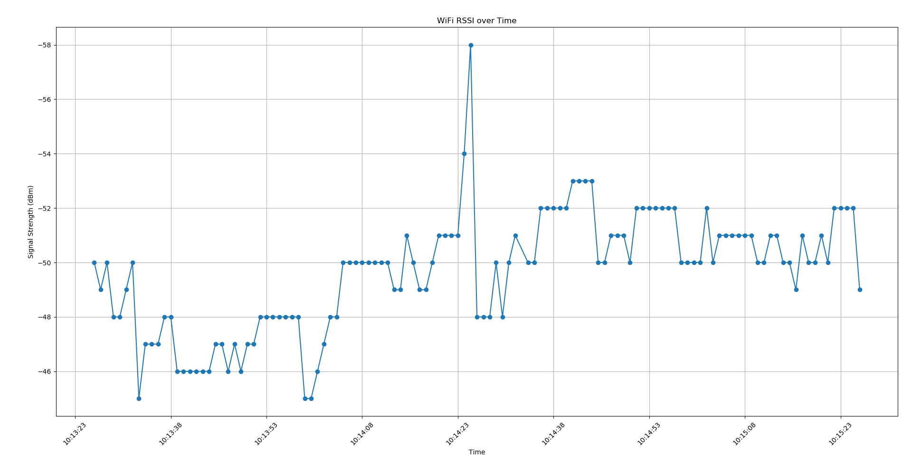

# 📡 WiFi RSSI-Based Human Motion Detection


---


<br>


---

## 🛠 How It Works Physically

- A human body **reflects and absorbs WiFi signals**.
- When a person moves near the router or wireless device, the **RSSI fluctuates**.
- These fluctuations can be captured using Linux tools like `iwconfig` or `iw`.
- By analyzing the **variation patterns over time**, we can classify whether there was **motion** or the environment remained **still**.

---

## 🔍 Approach

### 1. **Data Collection**
- RSSI is logged every second using a shell command wrapper in Python (`iwconfig`).
- Walking or standing still scenarios are recorded for 2-minute sessions.

### 2. **Feature Extraction**
For each 5-second window:
- **Mean RSSI**
- **Standard Deviation**
- **Variance**

These features reflect:
- Stability (stillness)
- Intensity of signal change (motion)

### 3. **Labeling**
- If standard deviation is low → labeled as `still`
- If RSSI fluctuates rapidly → labeled as `motion`

### 4. **Model Training**
We train 3 classifiers:
- ✅ SVM
- ✅ kNN
- ✅ Decision Tree

Each model is evaluated using:
- Accuracy
- Precision
- Recall
- F1-score

### 5. **Comparison**
A bar chart visually compares how each model performs in classifying motion accurately.

---

## 📈 Insights

- **Decision Trees** showed perfect accuracy on the current dataset — likely due to its ability to learn clean thresholds.
- **kNN** performed nearly as well and is easy to tune.
- **SVM** struggled with overlap in feature space, especially in separating still and motion if signal was noisy.
- Even with **no extra hardware**, it's possible to detect environmental motion using only WiFi RSSI — useful for **non-intrusive monitoring**, **home automation**, or **low-cost security systems**.

---

## 🚀 Project Structure

```
wifi_motion_detection/
├── data/
├── models/
├── visuals/
├── src/
├── README.md
├── requirements.txt
```

---

## 👨‍💻 Author

Built by Shyam SN — exploring the edge of signal processing and machine learning with zero hardware cost. 🚀
